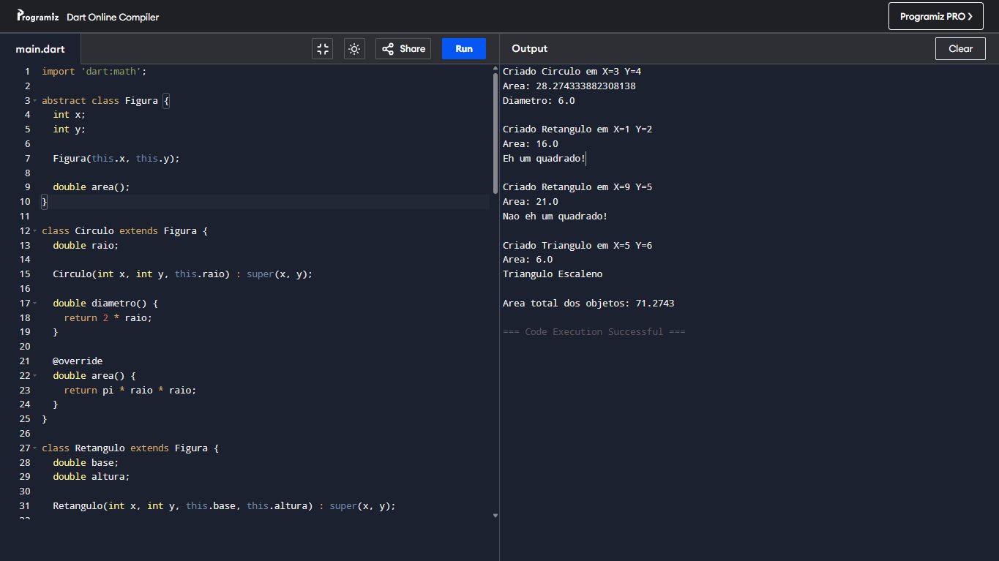

# Screenshots

## Gerenciador de Figuras Geométricas

Este projeto foi desenvolvido em **Dart** para a disciplina de Desenvolvimento Multiplataforma 1.

O sistema cria diferentes tipos de figuras geométricas e calcula suas áreas.

### Figuras implementadas

* Círculo
* Retângulo
* Quadrado
* Triângulo

Foi criada uma classe abstrata chamada **Figura**, que define o método `area()`.
As classes **Circulo**, **Retangulo** e **Triangulo** herdam dessa classe e implementam seus próprios cálculos de área.

No método `main`, são criados objetos dessas figuras, armazenados em uma lista e, ao final, é calculada a **soma total das áreas**.

#### Vizualizar o código online

Copie e cole no seu navegador o link abaixo para abrir e executar o código.

https://www.programiz.com/online-compiler/89JIgwRnvi5EO
